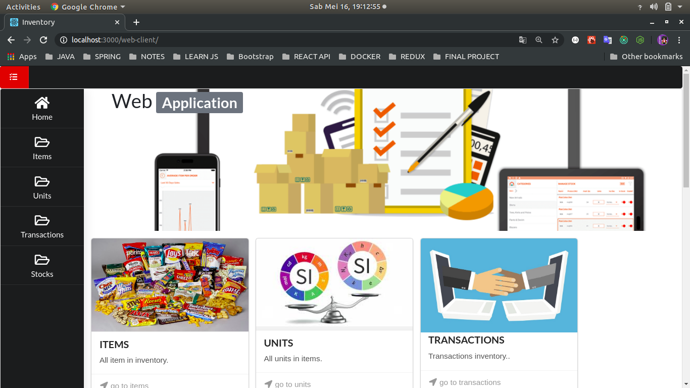
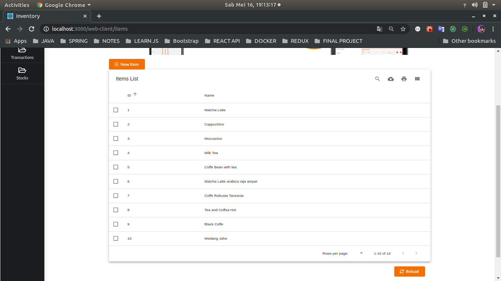
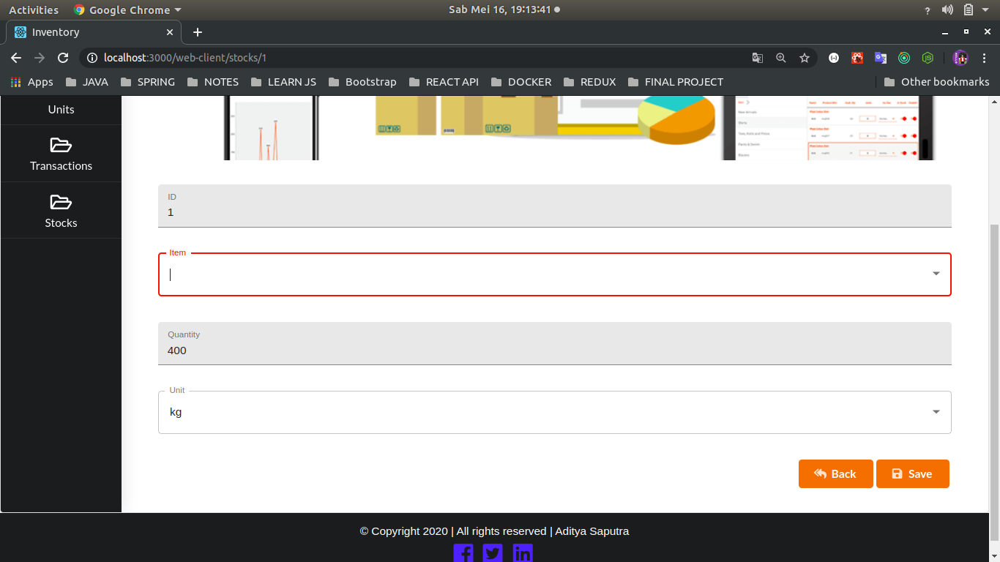
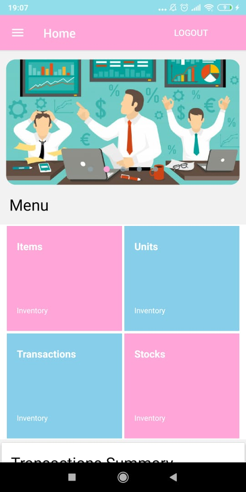
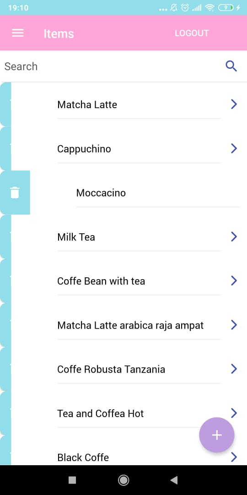
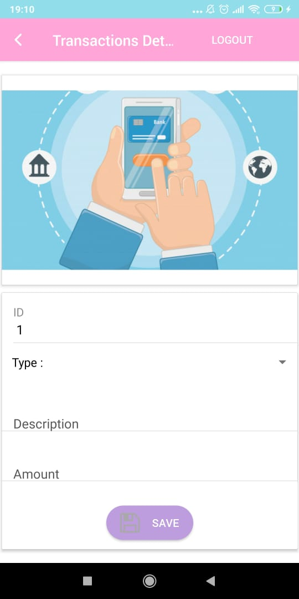
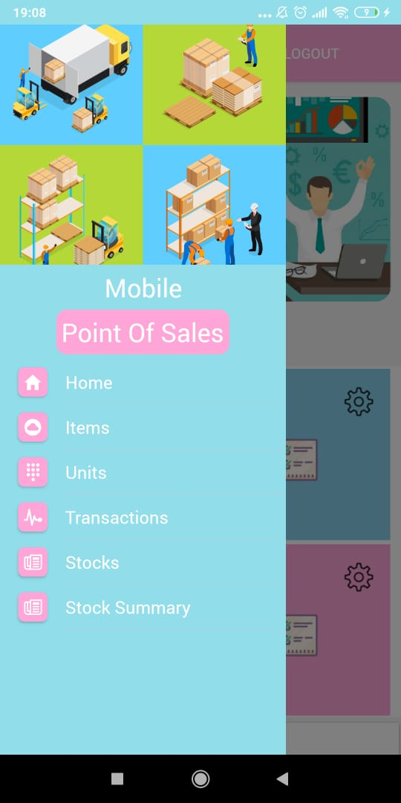
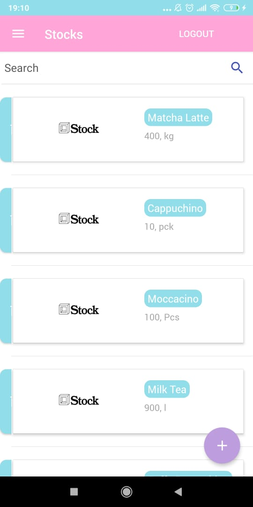
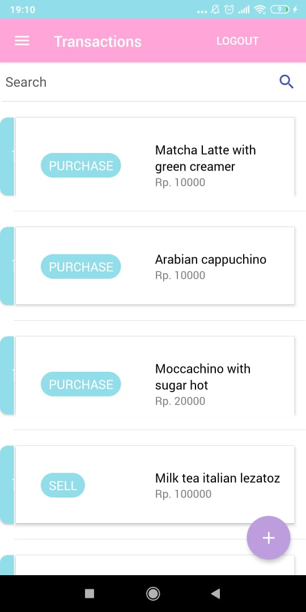

## Simple Project Restful API with Spring-boot, React JS and React Native.

### Website
+ Dasboard

+ Table

+ Table Detail, for edit or add new item


## Screen Mobile App

+ Login Screen with Jwt Auth


```
Admin
username: admin
password: 123

User
username: user
password: 123
```

+ Login Screen with Jwt Auth


+ Login Screen with Jwt Auth





